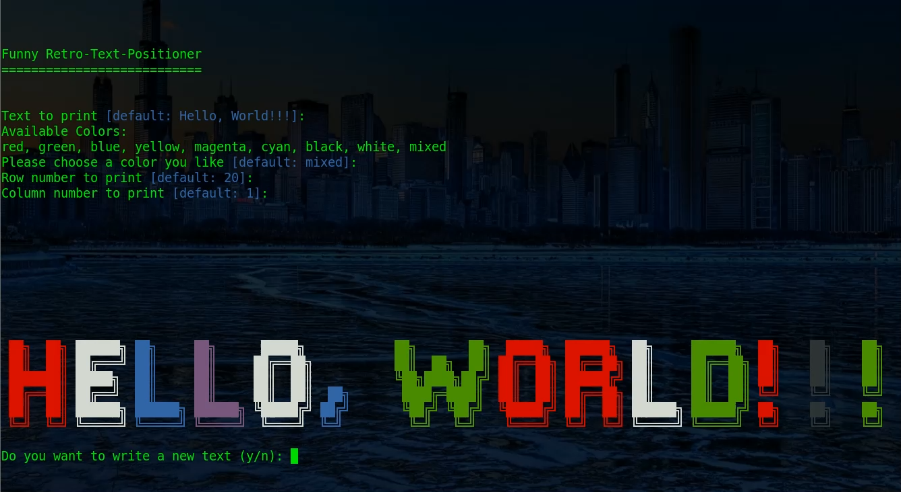

# Retro-Text-Positioner
Prints retrostyled text at a chosen position on the screen.

## _Description_
The program asks the User to input a text and converts it into a retro-styled output. :space_invader:
The User can decide if she or he wants to use the default values for `text`, `color` and 
`screen position` or test it with their own values. By default there is cool :sunglasses: 
mixed color output 

---

:bangbang: This program is currently not running under Windows :bangbang:

_This project was very exciting and funny to program. It was my first own project in Python.
And I think it was very teachful for the first steps._

_For a short demonstration please click on the picture below:_

To Do:
+ [ ] Make the program compatible with Windows. :white_square_button:
+ [ ] Saving the retrostyled text in a file :floppy_disk:
